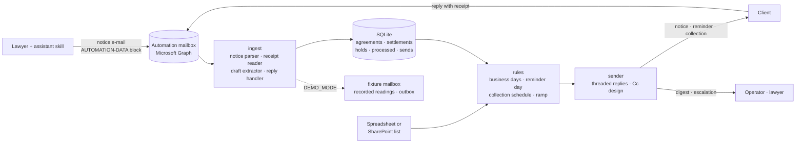

# settlement-reminder-pipeline

A daily pipeline for a litigation team whose clients pay court settlements in installments. A lawyer's notice e-mail registers the agreement; the client is reminded three business days before each due date, collected every two business days once an installment is overdue, and left alone the moment a receipt arrives, read by a language model and matched by amount; after five attempts the case goes to the lawyer. Every send is idempotent in SQLite, every doubt goes to a human, and the system never collects from someone who may have paid. Built for a Brazilian law firm's controllership; rebranded and anonymised here.

 

**Status:** in production for the original team since mid-2026 · **Runs offline:** yes, the demo needs no key, no tenant and no network

```
$ uv run settlement-reminders --demo
WARNING settlement_reminders: DEMO_MODE: fixture mailbox, recorded readings, e-mails written to .demo/outbox
INFO  ingest.pipeline: Notice processed: case=0001234-74.2099.5.99.0001 operation=REGISTER status=active issues=0
INFO  demo: [OUTBOX] ACORDO PACTUADO - 0001234-74.2099.5.99.0001 - FULANO DE TAL X EXEMPLO ENGENHARIA LTDA -> to=['finance@exemplo-engenharia.example', ...]
INFO  ingest.store: Installment 0001234-74.2099.5.99.0001#O1P1 settled (receipt): R$ 3000.00 on 16/09/2026 (receipt-3000.pdf)
INFO  ingest.pipeline: Test notice ignored: '[TEST] ACORDO PACTUADO - 0001234-74.2099.5.99.0001 - ...'
WARN  ingest.pipeline: invalid notice in 'ACORDO PACTUADO - 0002222-43.2099.8.99.0002 - PARTE X CLIENTE': required key missing: COUNTERPARTY
INFO  ingest.pipeline: PDF ignored (not addressed to the bot (group traffic)): "Contract for the team's review"
INFO  run: Skipped (already settled): 0001234-74.2099.5.99.0001#O1P1
INFO  demo: [OUTBOX] LEMBRETE DE PAGAMENTO DA 1ª PARCELA DE ACORDO - 0000165-98.2099.5.99.0003 - ... -> to=['payments@comercio-modelo.example']
INFO  demo: [OUTBOX] PAGAMENTO EM ABERTO - 1ª PARCELA DE ACORDO - 0001979-51.2099.5.99.0002 - ... -> to=['finance@loja-exemplo.example']

Run of 2026-09-17 (Thursday) | mode: DEMO | sources: notices, excel
Agreements: 5 | installments: 16
Ingested: 3 notice(s)/draft(s) | settled by receipt: 1 | to check: 2
Reminders: selected 2 | sent 1 | simulated 0 | already sent 0 | already settled 1
Collections: sent 1 | simulated 0 | on hold 0 | escalated 0
  settled:   receipt from finance@exemplo-engenharia.example settled 0001234-74.2099.5.99.0001#O1P1; 2 installment(s) still open
  check:     reply from board@exemplo-engenharia.example about case 0001234-74.2099.5.99.0001 without an attached receipt
  check:     invalid notice 'ACORDO PACTUADO - 0002222-43.2099.8.99.0002 - PARTE X CLIENTE': required key missing: COUNTERPARTY

$ uv run settlement-reminders --demo          # the same day again: nothing goes out
Reminders: selected 2 | sent 0 | simulated 0 | already sent 1 | already settled 1
Collections: sent 0 | simulated 0 | on hold 0 | escalated 0
```

The e-mails to the client are in Portuguese because the clients are Brazilian companies; the internal e-mails, the code and the logs are English. Every party, address and case number in the demo is invented.

## The problem

A labour litigation team settles dozens of lawsuits a month, and the firm's client pays each settlement in installments over months. Someone had to remember every due date, warn the client in time, chase the client when the date passed, read the receipt when it came, know when to stop chasing, and hand the case to the lawyer when the client simply did not pay. Late-payment clauses in these settlements are brutal (a fifty per cent fine from the fifth day is common), so a missed reminder costs the client real money, and collecting from a client who has already paid costs the firm the relationship. The controllership ran this on a spreadsheet and a shared calendar; it worked until the volume did not fit in one person's head.

## What it does

- Registers a settlement from the notice a lawyer already sends to the client: the e-mail carries a machine block written by an assistant skill, parsed deterministically, so registration costs no model call and the client's addresses come from the person who read the agreement. A forwarded PDF draft still works as a fallback, read by the model and matched to the client directory.
- Reminds the client three business days before each due date (national and state holidays included, the original date moved to the next business day and the postponement explained in the e-mail), with the amount spelled out, the beneficiary's honorific, the bank details and the late-payment clause transcribed from the document.
- Collects an overdue installment every two business days, up to five attempts, at most one collection per agreement per day, always as a reply in the notice's own thread; then escalates to the lawyer and stops.
- Settles an installment from the client's reply: the receipt (PDF or a screenshot) is read by the model, and the oldest open installment with the exact amount is settled. Any attachment that could be a payment and matched nothing puts the case on hold instead of being collected.
- Sends the operator one digest a day with only what needs a human: pending registrations, replies to check, holds, escalations, failures. A management CLI settles, closes, releases holds and audits the real sends against the store.

## Architecture



The daily run (`run.py`) sweeps the mailbox, then walks every installment of every active agreement through the rules. The ingest package turns messages into store records: `notice.py` parses the versioned data block without a model; `receipt.py`, `extract.py` and `matcher.py` are the three places a model is called, and each returns structured data with a confidence that the rules then judge. `history.py` and `store.py` keep the state in one SQLite file. The Graph client, the mailbox reader, the readers and the sender are the boundaries; `factory.py` is the only module that picks the demo adapters, so the business code never knows which mode it runs in.

## Design decisions

- **The notice carries its own data, and the parser is deterministic.** The first version read PDF drafts with a model and looked the client up in a directory; it worked, and it was the wrong shape: the directory was incomplete, the model call cost time and money for a document a lawyer had just read, and mistakes surfaced days later. Now the skill that writes the notice appends a `KEY: value` block, versioned, that the pipeline parses in code. Cost: a strict format that lawyers never see, and a fallback path for drafts that must stay alive.
- **The model reads; the rules decide.** A receipt reading returns "is it a receipt, amount, date, beneficiary"; settlement is an exact amount match on the oldest open installment, in code. No date arithmetic, matching or sending decision lives in a prompt, because a wrong amount from a model looks exactly like a right one. Cost: a partial payment or a rounding difference does not settle anything and puts the case on hold for a human.
- **Never collect from someone who may have paid.** An attachment that could be a payment and matched nothing, an attachment the reader could not open, a failed reading, a mailbox that could not be swept: each puts the collection and the escalation of that case (or of the whole day) on hold, with a stated reason, until a human settles or releases. Cost: holds need a person; the daily digest exists so that person sees them.
- **Idempotency in SQLite, with the mode in the key.** Every send is recorded as sent, simulated or failed; a simulation made in shadow mode never consumes the real send after go-live; a second run of the routine on the same day sends nothing; missed attempts after downtime are replayed one per agreement per day, keyed on the run day, never on a reminder day. Cost: a week offline takes a week to catch up, on purpose.
- **One conversation per agreement.** The notice opens the thread, and every reminder and collection is a reply in it, found through the Sent Items; when the app lacks the permission to reply, the sender falls back to a new message by itself. Cost: a read permission on the mailbox and a `link-threads` command for agreements registered before threading existed.
- **Copies are a design, not a setting.** The controllership is copied on everything, for awareness rather than approval; a team mailbox is copied on notices and reminders but never on collections; extra copies can be tied to a payer or written into one notice. The signature is a department, never a person, so nobody is personally chasing a client.

## How AI was used

- **Generated:** the original Portuguese version was written with an AI coding assistant over a few months of daily use, in shadow mode first; this English version was produced by translating and restructuring it with the same assistant, with the demo adapters, the fixture mailbox and the notice skill's English documentation introduced in the process.
- **Rewritten by me:** the calendar and the cycle (business days with the state's holidays, the reminder day, the catch-up window, the schedule of attempts and the one-per-day ramp) and the rules of the e-mails a Brazilian client expects (feminine ordinals, amounts in words, the honorific with the right preposition, the late clause transcribed and never computed), each with tests before the code.
- **Validated:** 227 tests run offline; the readers are replaced by recorded readings, the mailbox by eight fixture messages that cover every route of the sweep, and the whole demo is asserted end to end up to the escalation day.
- **Rejected designs:** letting the model say which installment a receipt settles (it picked the next open one even when the amount differed); replaying every missed collection on the first run after downtime; marking messages as processed in the mailbox itself (the store carries that state, and the mailbox is never modified); an approval step for the controllership (it wanted to see, not to sign).
- **Commits:** made with an AI coding assistant; attribution trailers are omitted and AI usage is documented here.

## Evaluation

| What | Result | Set |
|---|---|---|
| Notice block parsing | deterministic; tolerances (Brazilian amounts and dates, rewrapped lines, HTML entities) and every structural error covered | unit tests |
| Receipt to installment matching | exact amount ±0.01 on the oldest open installment; a non-receipt, an unreadable file and an unmatched amount each take the documented route | unit tests with recorded readings |
| Mailbox sweep routes | 8 of 8 fixture messages take the expected route; a second sweep touches none | demo fixtures |
| Receipt reader accuracy | not measured yet | no golden set |

The readers have no golden set. The plan is fixed: forty synthetic receipts (PIX screenshots, bank slips, transfer confirmations, and non-receipts such as signatures and contracts) scored on the receipt flag, the amount and the date, with the numbers recorded here.

## Cost & latency

Registration through a notice costs no model call. A receipt reading is one call per attachment, with adaptive thinking, image or PDF: cents per receipt at list prices and a few seconds. A legacy draft extraction is one call per PDF with the whole document as input: tens of seconds and on the order of ten to twenty cents. The daily run itself takes seconds for a few hundred installments; the mailbox sweep is bounded by the lookback window and never downloads an attachment from a message the pipeline will not process.

## Known failure modes

- **A partial payment.** A receipt for less than the installment matches nothing: the case goes on hold and the operator settles by hand or releases. The pipeline does not split installments.
- **The same receipt sent twice.** The second copy matches nothing (the installment is already settled) and puts the case on hold with that reason; the operator releases it.
- **A receipt sent to the lawyer instead of the automation.** Nothing happens until the lawyer forwards it, keeping the case number in the subject; senders on the firm's domain are allowed to forward receipts.
- **A wrong case number in the notice.** The agreement is registered under it and the client's replies will not match; only a correction notice fixes it. The parser catches the format, not the meaning.
- **A holiday calendar for another state.** The subdivision is a setting; a firm in another state that forgets it will move due dates one day late on its own state holidays.
- **A mailbox that cannot be swept** holds every collection and escalation of the day: better a late collection than one sent over an unread receipt.

## Data & privacy

In production the pipeline handles personal data: names, bank details and receipts of clients and counterparties. Receipts and drafts are sent to the model API only to be read, in memory, and are not stored by the API; the state lives in one SQLite file inside the firm's tenant; the client's addresses come from the lawyer's notice, never from a scrape; the Graph app is restricted to the automation's mailbox by an application access policy and never modifies it. This repository runs on fictional data only: invented parties on reserved `.example` domains and case numbers dated 2099 with invalid check digits. The system is decision support for a controllership: a human settles what the rules could not, releases every hold and decides on every escalation.

## Tests & CI

`uv run pytest` runs 227 tests offline: the business-day calendar over national and state holidays, the reminder and collection schedules with the catch-up window, idempotency across the dry-run and live modes, the notice parser's tolerances and errors, the mailbox sweep over the eight fixture messages, replies and holds, the store, the templates rendered and checked for the Portuguese wording, the threaded sender with the permission fallback, and the demo end to end, including the walk to the escalation. CI runs lint, the tests, a check that the generated fixtures match their script, the demo twice on the same day (the second run must send nothing) and along the six days to the escalation, the template previews and a gitleaks scan.

## Stack

`Python 3.12` `uv` `Pydantic` `pydantic-settings` `httpx` `MSAL` `Microsoft Graph` `SQLite` `Jinja2` `openpyxl` `holidays` `num2words` `Anthropic SDK (structured outputs, PDF and image input, adaptive thinking)` `pytest` `ruff` `GitHub Actions` `Windows Task Scheduler` `Docker`

## Running locally

```bash
git clone https://github.com/fillipeml/settlement-reminder-pipeline
cd settlement-reminder-pipeline
uv sync
uv run settlement-reminders --demo                    # the fixture day, 2026-09-17
uv run settlement-reminders --demo --date 2026-10-01  # the escalation day
ls .demo/outbox                                       # every e-mail, as the recipient sees it
uv run settlement-agreements list --demo
uv run settlement-audit --demo
```

For a real tenant, copy `.env.example` to `.env`, fill in the Graph app (see [docs/GRAPH_SETUP.md](docs/GRAPH_SETUP.md)), keep `DRY_RUN=true` for a few days and read the digest, then switch it off. `scripts/register_scheduled_task.ps1` installs the daily task on Windows; the `Dockerfile` runs the same routine from any scheduler with the state on a volume.

## Demo mode

Every external system sits behind an interface with a local implementation selected only in `factory.py` by `DEMO_MODE=true`: a fixture mailbox with eight messages, recorded readings instead of model calls, and a sender that writes each e-mail to `.demo/outbox/`. The clock is pinned to the day the fixtures are built around and can be moved with `--date`. See [docs/DEMO.md](docs/DEMO.md) for the three-minute walkthrough, [docs/NOTICE_FORMAT.md](docs/NOTICE_FORMAT.md) for the data block, and [skills/settlement-notice/SKILL.md](skills/settlement-notice/SKILL.md) for the assistant skill the lawyers use.

## What I'd do next

- Build the synthetic receipt set and publish the readers' accuracy.
- Support partial payments: a receipt below the amount settles part of an installment and the remainder keeps its own schedule.
- Replace the operator's CLI with a small web console for holds, pending registrations and the audit, with a record of who released what.

## Glossary

Brazilian legal and operational terms, and the Portuguese kept on purpose in the client e-mails, are explained in [docs/GLOSSARY.md](docs/GLOSSARY.md).

## Licence

MIT
